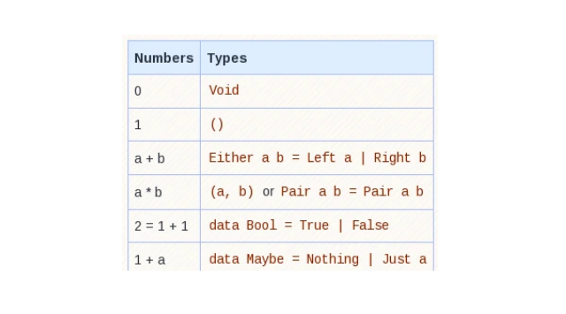
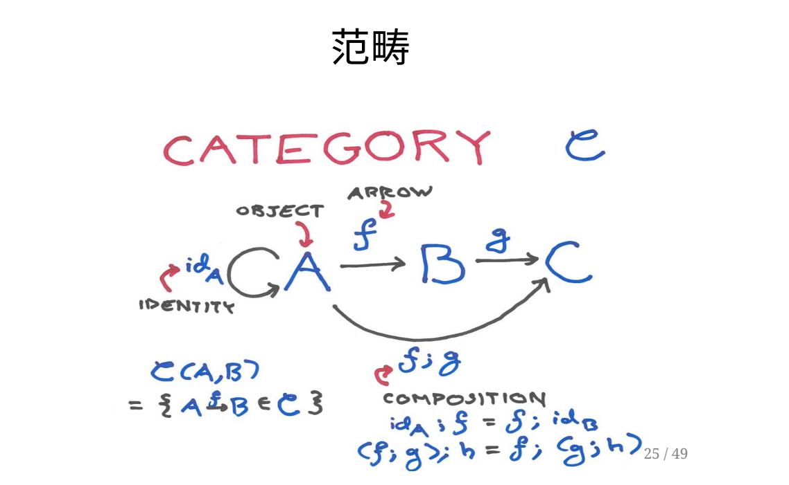
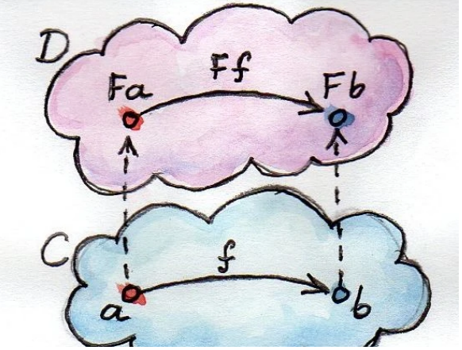
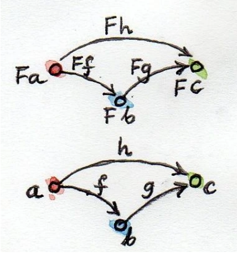
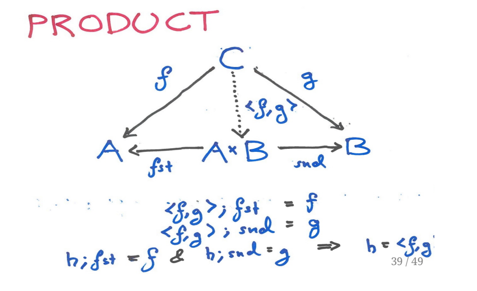
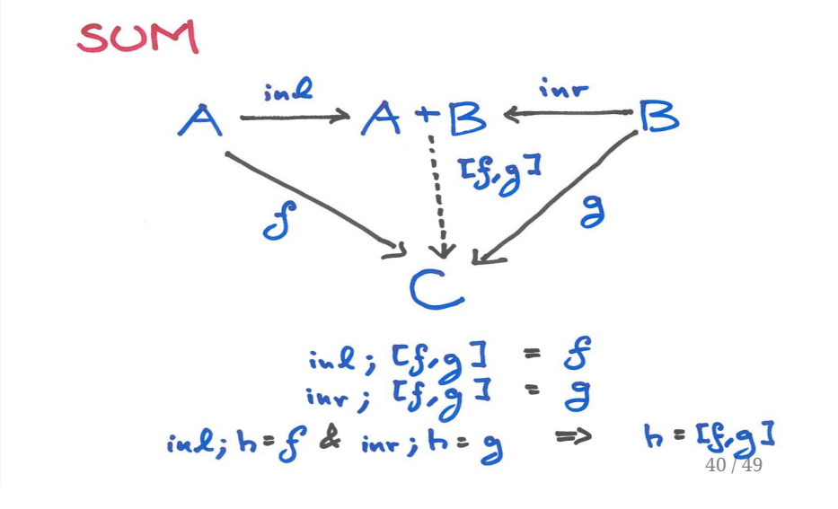

# Yet Another Algebraic Data Type

作者：_KnifeFire_

## ADT是个啥

初始代数语义下代数数据类型的结构与解释 -- 图解。

我以⽹名担保不出现超过中学算术的公式。


## AlgebraicDataType

起源于HOPE语⾔(1980 ACM LispConference)

发扬于ML (MetaLanguage)

⽬测很像算术




## 类型算术

实际上，它的确存在着某种像算术⼀样的性质

让我们来动⼿试试吧

## 0/1之间

Void类型没有可⽤的值(从值的数量上看它应该是0)

```haskell
Prelude Data.Void> :i Void
data Void
    -- Defined in ‘Data.Void’
```

它的定义不可谓不简单

空元组在 haskell 中通常读作 unit，写作 `() `

它仅有⼀个值

```haskell
Prelude> :i ()
data () = ()
    -- Defined in ‘GHC.Tuple’
```

## ⾮此即彼

haskell使⽤严格的布尔类型

```haskell
Prelude> :i Bool
data Bool = False | True
    -- Defined in ‘GHC.Types’
```

它所表⽰的数是2，因为它有True和False俩个值

## `|`是什么

⾸先排除汉字gun(⼁)

然后排除命令⾏管道

它起到的作⽤是分隔集合元素

想象⼀下，类型Bool是个集合，⽽False和True是它⾥⾯蕴含的元素

## 乘法

简单的2元组担任乘法的职责

```haskell
Prelude> :t ((), True)
((), True) :: ((), Bool)
Prelude> :t ((), False)
((), False) :: ((), Bool)
```

显然，`1 * 2 = 2` ，所以 `((), Bool)` 这个类型有俩个值

## 加法

虽然|已经把加法的活⼲了，但是haskell还特地定义了Either

```haskell
Prelude> :i Either
data Either a b = Left a | Right b
    -- Defined in ‘Data.Either’
```

⾮常直觉

```haskell
Prelude> :t (Left "foo")
(Left "foo") :: Either [Char] b
Prelude> :t (Right False)
(Right False) :: Either a Bool
```

## 函数类型

以 `() -> Bool` 这个函数类型为例，它表达的是 `Bool ^ () => 2 ^ 1 = 2`

```haskell
Prelude> :t \() -> False
\() -> False :: () -> Bool
Prelude> :t \() -> True
\() -> True :: () -> Bool
```

这个结论看起来稍微有点怪异

但是仔细想想

我们可以把函数转换为打表，就像指数运算可以转化为⼤量的乘法

代码即数据

## 没有了

多乎哉？不多矣！

ADT是崇尚引⽤透明的

我们已经⻅到了代数数据类型的基本单元

其他复杂的类型⼤可通过它们合成

## 等等。递归呢？

它可以很直观地表达

```haskell
Prelude> data Nat = Z | S Nat
Prelude> :t S (S Z)
S (S Z) :: Nat
Prelude> data List a = Nil | Cons a (List a)
    -- f(a) = 1 + a * f(a)
```

但是在更贴近理论时，我们会谈到⼀个叫做不动点的玩意。

## 微分

我们有能⼒做加和乘 

也可以定义递归 

那么能求导吗？

## Zipper

对代数数据类型的求导会得到著名的函数式抽象 -- The Zipper 

它常被⽤于遍历复杂的数据结构 

和微积分中的导数相同，对类型求导的结果描述了原本结构的局部特征 

你也许会需要：haskell趣学指南 第14章

## 但是求导过程中出现了-和/

可能已经有⼈⼿快算了⼏个例⼦ 

别急，其实-和/在类型上有对应的概念和相关研究 

它们有意义，不过暂时还没看出来有什么⽤例

## 简单的类⽐缺乏说服⼒

为什么类型居然能求微分 

(如果有⼈⼿快，他可能已经发现Leibniz rule和chain rule也能验证) 

这背后藏着什么？

## Ghost intheshell

我们需要引⼊所谓的范畴论 

它是初始代数语义的基⽯

## 语义是什么?

⼀般来说，我们认为编程语⾔的语义就是这⻔语⾔是如何被执⾏的。 但是， 这只是语义中的⼀种：Operation Semantic（操作语义？）。 操作语义就 是通过⼀系列规则描述语⾔中的表达式如何⼀步步求值， 也就是⽤逻辑规则 “实现”了⼀个解释器来对表达式求值。 然⽽，在编程语⾔的研究中，还有另 外⼀种很重要的语义描述⽅式： Denotation Semantic（指称语义？）。 指称语义中，我们并不描述表达式是如何求值的， ⽽是将表达式、类型等等 在某种数学模型下赋予意义。 换⾔之，指称语义把语⾔中的表达式“编译”成 了数学模型中的对象。 那么，这有什么意义呢？ 我们把C编译成汇编，是因 为汇编更容易在机器上执⾏。 ⽽我们通过指称语义把语⾔编译成数学对象， 是因为通过已经被详细研究过的已知数学对象，可以更好地研究语⾔的性 质。 

-- 游客账⼾0x0 : 推导Simply Typed Lambda Calculus的范畴论语义

## 都市传说

haskell并⾮⼀种崇尚范畴论的语⾔，实际上，它在ML语⾔家族⾥的兄弟，OCaml， 其名称中的“Caml”是 Categorical Abstract MachineLanguage 的缩写。

 谁更热爱理论？ 我仅站在个⼈⻆度呼吁，拒绝⼀些完全罔顾事实的偏⻅，haskell是完全的⼯业语⾔。

## ⻥梯

美籍作家罗格纳.本森在他的⼀本技术性⼿册中提到，他认识⼀个在俄勒冈州渔业部⻔ ⼯作的年轻⼈，热衷于谈论硝基甲烷。 

在他的⼯作中常常需要⽤它和粉状硝酸铵混合去构建⻥梯(?)。 

好吧，其实就是起爆 

⼤体上说来，⻥梯是⼀种帮助⻥类洄游的设施，是对兴建⽔库，⽔坝等设施的补偿。

## 转向理论

现在假定有台阶A B C，它们在同⼀条⻥梯上从上到下排布 

很⾃然地，我们可以把⽔从A流到B画成纸上从符号A到B的箭头，写出来⼤概是A -> B。 

那么很⾃然地，有A -> A, B -> B, C -> C 因为⽔从某个台阶上流过可以看作⽔从它流向⾃⾝。 

A -> B 和 B -> C, 也是天经地义的事, ⽔往低处流嘛。

## 等等，我们遗落了什么?

⽔从A流向B，⼜从B流向C，从规则上看我们可以增加⼀条描述: A -> C

## 结合性

当我们拿到⼀对头尾相连的箭头，总是可以把它们组装成⼀个箭头 

别忘了, 我们其实是在谈论⻥梯上的⽔流。

 但是此时我们⼏乎离开了⽔ 

也不在乎⻥梯对⻥到底有没有⽤ 

我们开始只关注⼀些脱离现实世界复杂度的**抽象性质**


## 暂时回到现实 

不管怎么样，⼀条河有俩条岸，建2条平⾏的⻥梯当然可⾏

那么，平⾏⻥梯上的台阶，它们之间能画箭头吗？ 

在现实中和我讨论这个问题，我⼤概会使劲拿⽔循环来抬杠 

但是在这⾥，我们要为模型的简单做考虑 

所以答案是：没有

## 重新观察结合性

单⻥梯模型中所有台阶都相连的事实稍微有点误导性 

实际上，结合性只意味着可以从已有的箭头组合出新箭头 

⽽不强制要求某个地点所有⻥梯台阶之间都有箭头连接



## 那就是范畴的定义吗

是的。 

⻥梯台阶 => 对象 (Object) 

箭头 => 态射 (morphism || arrow) 

恒等态射和结合性让范畴具有特定结构。

## 但是⻥梯听起来⼀点也不酷

那么把⻥梯当作⼀个个偏序集吧。

## 偏序集与⺓半群

范畴这⼀结构便是由它们俩合成的 

恒等态射(id)和任意其他态射f连接，其结果总是等价于f(⺓半群) 

不是所有对象之间都有箭头,但是已经存在的箭头⼀定可结合/传递(偏序集)

## Category,Revisited

严肃讲起来范畴有俩个等价的基础定义 

各路教材为了⽅便引⼊可能还会有其他奇怪的定义(⽐如从图论引⼊) 

既然这只是⼀个“引起兴趣”的分享，就跳过吧 

对此感兴趣可以参考ncatlab.org提供的⼤量资源

## Set category

集合与全函数构成的范畴 

亦是Haskell壬主要居住区 

(现在可别说什么bottom和unsafe煞⻛景)

## Hom集

在Set范畴中任意对象A，B之间的全体态射也构成⼀个集合 

⼀般写作Hom(A, B)

对应到haskell，就是函数类型：

```haskell
A->B
```

有些范畴中任意⼀对对象之间的态射不构成集合 

好在那不会出现在这⾥ 

你会看⻅的另⼀种说法：这个范畴是locally small的

## 函⼦

把范畴想象成⼀张⽹ 

函⼦的⼯作是不切断其中的线，通过卷起来或者拉伸的⽅法把它投影到另⼀张⽹上



## 分治

函⼦需要分别处理范畴中的对象和态射,但⼤多数时候重点在态射上。对于原范畴中的 恒等态射，它应该被投影到⽬标范畴中的恒等态射上,⽽原范畴中头尾相连的态射在⽬ 标范畴中仍然应该头尾相连。可以看出，范畴论重视对象间关系胜过具体对象




## classFunctor

具体到haskell中稍微有点不同 

haskell中typeclass Functor所定义的函⼦ 

其实是从Set到Set⾃⾝的⾃函⼦(EndoFunctor) 

haskell只是参考了范畴论的很多概念 

⽽⾮严格对应

## fmap

fmap函数是函⼦处理态射的那⼀部分 

从签名就能看出来了

```haskell
class Functor f where
    fmap :: (a -> b) -> (f a -> f b)
```

当我们拿到原本范畴中的⼀个态射,fmap将它转换为⽬标范畴中的⼀个态射 当然了

```haskell
fmap id == id
-- id这个函数是haskell标准库的⼀部分
```

## 这⾥本来应该有⼀些例⼦

但是我想这是haskell书都会写的内容 

请看haskell趣学指南的第11章吧！

## 同构

当我们可以在俩个对象之间来回穿梭⽽不伤⾝体-- 

其实就是上图中的⼀对态射可以“⽆损”地做转换 

它们的组合可分别得到俩个对象上的恒等态射。 

在haskell中，这意味着俩个类型的值数量⼀致。

当涉及可数⽆穷时，事情会变得很怪异

## 泛泛⽽谈

实际上，同构是⼀种所谓的泛构造 

> 范畴论中有⼀个常⻅的构造，叫做泛构造（Universal Construction），它 就是通过对象之间的关系来定义对象，其⽅式之⼀就是拮取⼀个模式——由 对象与态射构成的⼀种特殊的形状，然后在范畴中观察它的各个⽅⾯。如果 这个模式很常⻅⽽且范畴也很⼤，你就会有⼤量的机会命中它。技巧是如何 对这些命中机会进⾏排序，并选出最好的那个。 
> 
> -- category theory for programmers 

product coproduct limit colimit end coend left/right [Adjunction, Kan Extension] 

⼀个不⼩的菜单 

作为流动摊点，很遗憾只能略举product/coproduct为例了

## product



## coproduct



## 最终降临:多项式函⼦

和，积， 指数，它们可以构成所谓的多项式函⼦ 

它是多项式这⼀概念的范畴化 

就像裴蜀定理可以从多项式推⼴到主理想整环上 

微积分中的⼀些定理同样适⽤于多项式函⼦ 

(精确的定义，还请参阅ncatlab和Notes on Polynomial functor)

## F-Algebra

我们⾸先对⼀个代数结构进⾏范畴化，画出它的交换图 

(详细步骤请参阅刘新宇先⽣的同构⼀书，章节4.5) 

然后⽤⼀个多项式函⼦F编码其结构 

通过抽取出基底对象，所谓的“Algebra”和同态映射 

我们得到了此代数结构的范畴表⽰

## 来点直觉

这是所谓的Algebra

```haskell
type Algebra f a = f a -> a
```

这⾥的Algebra来⾃阿拉伯语词根，意为“重组” 描述下代数结构的形状

```haskell
data MonoidF a = MEmpty | MAppend a a
```

⽤⼀个具体的Algebra去解释它

```haskell
alg4String :: Algebra MonoidF String
alg4String MEmpty = ""
alg4String (MAppend x y) = x ++ y
```

## 加点类⽐

F => 抽象语法树 

a => 抽象语法数的具体解释⽅式 

具体的某个Algebra f a => 解释器

## Initial Algebra

对⼀个多项式函⼦来说 

Initial Algebra是⼀个这样的Algebra

```haskell
initAlg :: f i -> i
```

类型f i和i同构

## ⽆穷的开端

请把i想象成f的⼀个不动点吧。因为 f i ~= i

是的，这⾥潜藏着递归 

这个不动点i，可以粗略地看作ADT中的类型 -- 但不全 

因为还有对偶的概念F-CoAlg和Terminal Algebra呢

## 标题回收

Initial Algebra正是初始代数语义的核⼼概念

## ⼀些事实

- 显然我没做到展⽰完整的初始代数语义这个框架，由于要⽀持⼀个叫做 fold/build的规则转换，我们得⽤到⼀个所谓的扩展初始代数语义，为此将不得 不引⼊极限和泛锥的概念，那真的太耗时了，它没办法直接⽤haskell代码对应 
- haskell⾥⾯的不是真ADT，有些类型上定义不出来所需的同构代数，关键词请搜 strict positivity

## 鸣谢

Trebor告诉了我Zipper对应ADT的微分运算 

感谢我所读过的所有相关材料的作者


