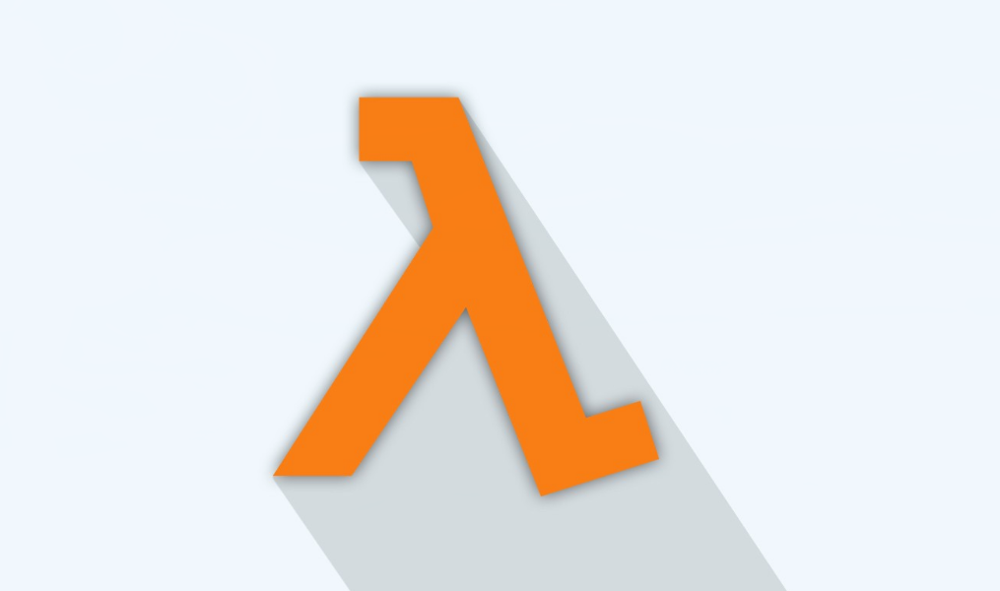
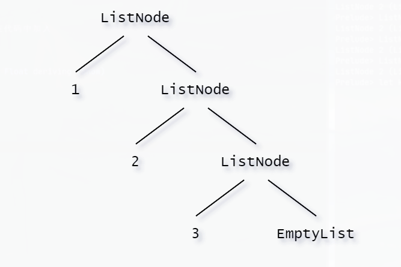

# Haskell Learning



## 目录

<!-- vim-markdown-toc GFM -->

* [Functional Programming](#functional-programming)
    * [副作用](#副作用)
* [基础语法](#基础语法)
    * [Type](#type)
    * [Typeclasses](#typeclasses)
    * [基础运算](#基础运算)
    * [函数调用](#函数调用)
    * [List](#list)
    * [List comprehension](#list-comprehension)
    * [惰性求值](#惰性求值)
    * [Tuple](#tuple)
* [Syntax in Functions](#syntax-in-functions)
    * [定义函数](#定义函数)
    * [Pattern matching](#pattern-matching)
    * [Guards](#guards)
    * [关键字 where 和 let](#关键字-where-和-let)
    * [Case expressions](#case-expressions)
    * [递归代替循环](#递归代替循环)
* [高阶函数](#高阶函数)
    * [Curried function](#curried-function)
    * [高阶函数](#高阶函数-1)
    * [一些高阶函数](#一些高阶函数)
    * [Function application](#function-application)
    * [Function Composition](#function-composition)
    * [lambda λ](#lambda-)
* [输入与输出](#输入与输出)
    * [运行一个 Haskell 程序](#运行一个-haskell-程序)
    * [Hello world](#hello-world)
    * [do block](#do-block)
    * [输入文本](#输入文本)
* [Type & Typeclass](#type--typeclass)
* [定义新的 Type 和 Typeclass](#定义新的-type-和-typeclass)
    * [Algebraic Data Types](#algebraic-data-types)
        * [Mylist](#mylist)
    * [Record Syntax](#record-syntax)
    * [Type parameters](#type-parameters)
        * [Either](#either)
    * [Derived instances](#derived-instances)
    * [Type synonyms](#type-synonyms)
        * [newtype keyword](#newtype-keyword)
    * [Recursive data structures](#recursive-data-structures)
    * [定义新的 Typeclass](#定义新的-typeclass)
        * [创建实例](#创建实例)
        * [Functor Typeclass](#functor-typeclass)

<!-- vim-markdown-toc -->

## Functional Programming

-   Pure functions
-   Immutable Data
-   No/Less side-effects
-   Declatative
-   Easier to verity

函数式编程是一种编程范式，我们常见的编程范式有命令式编程（Imperative programming），函数式编程（Functional Programming），常见的面向对象编程也是一种命令式编程。相比之下，函数式编程更关心数据的映射，命令式编程则关心解决问题的步骤。

命令式编程是面向计算机硬件的抽象，有变量（对应着存储单元），赋值语句（获取，存储指令），表达式（内存引用和算术运算）和控制语句（跳转指令）。简单来说，命令式程序就是一个冯诺依曼机的指令序列。

而函数式编程是面向数学的抽象，将计算描述为一种表达式求值。函数式编程希望程序员用计算（函数）来表示程序，用计算（函数）的组合来表达程序的组合。而非函数式编程则习惯于用命令来表示程序，用命令的顺序执行来表达程序的组合。

我们通过把大段代码拆成函数，通过一层一层的函数调用，就可以把复杂任务分解成简单的任务，这种分解可以称之为面向过程的程序设计。函数就是面向过程的程序设计的基本单元。

而函数式编程（请注意多了一个“式”字）—— Functional Programming，虽然也可以归结到面向过程的程序设计，但其思想更接近数学计算。

我们首先要搞明白计算机（Computer）和计算（Compute）的概念。

在计算机的层次上，CPU 执行的是加减乘除的指令代码，以及各种条件判断和跳转指令，所以，汇编语言是最贴近计算机的语言。

而计算则指数学意义上的计算，越是抽象的计算，离计算机硬件越远。

对应到编程语言，就是越低级的语言，越贴近计算机，抽象程度低，执行效率高，比如 C 语言；越高级的语言，越贴近计算，抽象程度高，执行效率低，比如 Lisp 语言。

### 副作用

在函数式编程的教材中，如下的行为是称之为**副作用**的：

-   修改一个变量
-   修改一个对象的字段值
-   抛出异常
-   在控制台显示信息、从控制台接收输入
-   在屏幕上显示（GUI）
-   读写文件、网络、数据库

很奇怪，如果函数式编程中，我们没有任何输入、输出等有副作用的操作，能编写什么样的程序呢？如果能，又是怎么做到的？

完整的回答这个问题可能需要写一本书（不用太长），这里的关键是：函数式编程是一种隔离应用逻辑（表达）与实际运行时解释的方法。
你的“函数式代码”用来表达（但不执行）所需要达成的执行效果，返回某种形式的数据结构来描述这个计算结果。然后，我们会在一个解释器中来执行该结果，后者不是函数式的。
完全的纯函数式编程是不可能的，一段纯函数式代码，出了会让 CPU 产生热量，不会产生其他副作用，我们还需要一个解释器来真实的进行 IO 操作，如读写文件、网络等。将两者隔离会带来很多的优势：纯函数式代码，更易于测试，引用透明性会让代码可读性提升，提高开发阶段的效率，减少 BUG，提高产品质量。同时，函数式编程，相比命令式编程，可以让很多复杂的代码便得更简单。
因此，在函数式语言中，处理副作用的方式就是隔离副作用，使用纯函数式的代码，来计算”副作用“，并将其表示为一个”值“，然后将该值交给一个解释器来执行，这个可以参考

Haskell 的语言特性有：纯函数式，值不可变，支持和类型（sum type），支持模式匹配，支持泛型与高阶泛型，支持特设多态，有较强类型推导能力，不支持子类型。

## 基础语法

### Type

Haskell 是 `Static Type`
的，在编译时期每个表达式的值就已经确定，提高了代码的安全性，同时 Haskell
支持类型推导。

| Type    | Description                     |
| ------- | ------------------------------- |
| Int     | 整型：-2147483648 ～ 2147483647 |
| Integer | 无界整型，但效率不及 Int        |
| Float   | 单精度浮点数                    |
| Double  | 双精度浮点数                    |
| Bool    | 布尔值                          |
| Char    | 字符                            |

### Typeclasses

| Typeclasses | Description              |
| ----------- | ------------------------ |
| Eq          | 包含可判断相等性的型别。 |
| Ord         | 包含可以比较大小的型别   |
| Show        | 可用字串表示的型别       |
| Read        | 与 Show 相反的 Typeclass |
| Enum        | 连续型别-可枚举          |
| Bounded     | 有上下限的 Typeclass     |
| Num         | 数字的 Typeclass         |
| Integral    | Int Integer              |
| Floating    | Float Double             |

```haskell
ghci> :t fromIntegral
fromIntegral :: (Num b, Integral a) => a -> b
```

`formIntegral` 取一个整数做参数并回传一个更加通用的数字，这在同时处理整数和浮点时会尤为有用。

型别定义行为的接口，如果一个型别属于某 Typeclass，那它必实现了该 Typeclass 所描述的行为。很多从 OOP 走过来的人们往往会把 Typeclass 当成面向对象语言中的 class 而感到疑惑，呃，它们不是一回事。易于理解起见，你可以把它看做是 Java 的 interface。

### 基础运算

| Char          | Function        |
| ------------- | --------------- |
| `+ - * /`     | 加减乘除        |
| `div`         | 整除            |
| `mod`         | 取模            |
| `True Flase`  | Boolean         |
| `\|\| && not` | 或且非          |
| `==`          | 条件判断 相等   |
| `\=`          | 条件判断 不相等 |

### 函数调用

```haskell
ghci> max 1 2
2
```

中缀函数与前缀函数的转换(`prefix` & `infix`)

-   对前缀函数加<code>``</code>使其变成中缀函数
-   对中缀函数加`()`使其变成前缀函数

```haskell
ghci> 4 `div` 2
2
ghci> 1 `max` 2
2
ghci> (+) 1 2
3
ghci> (||) True False
True
```

### List

**List 常用函数**

-   `(++)` :: [a] -> [a] -> [a]：合并两个列表

-   `(:)` :: a -> [a] -> [a]：将单个元素并入列表。[1, 2, 3]是 1:2:3:[]的语法糖

-   `(!!)` :: [a] -> Int -> a：通过索引取出某个位置上的元素。a !! 1 相当于 Python 中的 a[1]

-   `take` :: Int -> [a] -> [a]：返回列表 a 的前 n 个元素的列表(take n a)

-   `drop` :: Int -> [a] -> [a]：返回列表 a 中除去前 n 个元素后的列表(drop n a)

-   `elem` :: (Foldable t, Eq a) => t a -> Bool：判断值 n 是否在列表 a 中

> -   `head` :: [a] -> a：返回列表的第一个元素
> -   `tail` :: [a] -> [a]：返回列表中除去第一个元素后的列表（若只有一个元素则返回空列表[ ]）
> -   `last` :: [a] -> a：返回列表中的最后一个元素
> -   `init` :: [a] -> [a]：返回列表中除去最后一个元素后的列表
> -   `length` :: Foldable t => t a -> Int：返回列表的长度
> -   `null` :: Foldable t => t a -> Bool：返回列表是否为空
> -   `reverse` :: [a] -> [a]：返回翻转后的列表
> -   `maximum` :: (Foldable t, Ord a) => t a -> a：返回列表中的最大值
> -   `minimum` :: (Foldable t, Ord a) => t a -> a：返回列表中的最小值
> -   `sum` :: (Foldable t, Num a) => t a -> a：返回列表中所有元素的和
> -   `product` :: (Foldable t, Num a) => t a -> a：返回列表中所有元素的积

**Range**: `..`

```haskell
ghci> [1 .. 10]
[1,2,3,4,5,6,7,8,9,10]
ghci> ['a' .. 'z']
"abcdefghijklmnopqrstuvwxyz"
ghci> ['K' .. 'Z']
"KLMNOPQRSTUVWXYZ"
ghci> [2, 4 .. 20]
[2,4,6,8,10,12,14,16,18,20]
ghci> [3, 6 .. 20]
[3,6,9,12,15,18]
ghci> [5, 4 .. 1]
[5,4,3,2,1]
```

### List comprehension

$$\{x∣x\in N,3x+4<10,x<100\}$$

```haskell
ghci> [x * 2 | x <- [1 .. 10]]
[2,4,6,8,10,12,14,16,18,20]
ghci> [x * 2 | x <- [1 .. 10], x * 2 >= 12]
[12,14,16,18,20]
ghci> [ x | x <- [50 .. 100], x `mod` 7 == 3]
[52,59,66,73,80,87,94]
ghci> [x * y | x <- [2, 5, 10], y <- [8, 10, 11]]
[16,20,22,40,50,55,80,100,110]
```

### 惰性求值

haskell 是惰性的(call by need)，生成无穷列表之后通过 `take` 生成 list:

-   `cycle` :: [a] -> [a]：将原列表不断循环生成无穷列表

-   `repeat` :: a -> [a]：将传入的值不断重复生成无穷列表

    -   `replicate` :: Int -> a -> [a]：将值 a 重复 n 次，返回生成的列表(replicate n a)

*   **repeat**

```haskell
repeat x = x: repeat x
```

```
x : repeat x
x : x : repeat x
x : x : x : repeat x
....
[x,x,x,x...]
```

-   **take**

```haskell
take n _
    | n <= 0 = []
take _ []    = []
take n (x:xs) = x:take (n-1) xs
```

```
take 3 (repeat 3)
3 : (take 2 (repeat 3))
3 : 3 : (take 1 (repeat 3))
3 : 3 : 3 (take 0 (repeat 3))
3 : 3 : 3 : []
[3,3,3]
```

-   **doubleMe**

```haskell
doubleMe [] = []
doubleMe (x:xs) = x+x : doubleMe xs
```

```
take 5 (doubleMe (repeat 4))
```

```haskell
fib 0 = 0
fib 1 = 1
fib n = fib (n-1) + fib (n-2)

main = do putStrLn "Enter a number:"
          num <- readLn
          fibs = map fib [0..n]
          mapM' print fibs
```

```haskell
fibs = 0 : 1 : zipWith (+) fibs (tail fibs)

main = do putStrLn "Enter a number:"
          num <- readLn
          print (take n fibs)
```

**zipWith**

$$zipWith :: (a \to b \to c) \to [a] \to [b] \to [c]$$

第一个参数为一个函数，然后接收两个列表，将其对应元素传入接收的函数中，得到的结果组成一个新的列表。如果两个传入的列表长度不同，以最短的列表为准，长列表中超出的元素省略。用例：

```haskell
ghci> zipWith (*) [1,4,3,7] [1,7,3,4,7]
[1,28,9,28]
```

```
[0, 1, 1, 2, 3, 5, 8,  13...]
 +  +  +  +  +  +  +   +
[1, 1, 2, 3, 5, 8, 13, 21...]

[1, 2, 3, 5, 8, 13,21, 34...]
```

### Tuple

Haskell 中的元组可以有不同的长度，元素类型也可以不同，元组类型由其中的所有元素的类型共同决定。二元元组的常用函数：

-   `fst` :: (a, b) -> a：返回含有两个元素元组中的第一个元素
-   `snd` :: (a, b) -> b：返回含有两个元素元组中的第二个元素
-   `zip` :: [a] -> [b] -> [(a, b)]：接收两个列表，返回一个列表，每个元素是依次将两个列表中元素配对成的二元组

## Syntax in Functions

### 定义函数

直接定义一个函数：

```haskell
add' x y = x + y
```

这时 Haskell 会自动推断函数的类型为(Num a) => a -> a -> a。但是最好在定义函数前声明函数的类型：

```haskell
add' :: (Num a)=>a->a->a
add' x y = x + y
```

### Pattern matching

```haskell
luckyNumber :: (Integral a)=>a->String
luckyNumber 6 = "Lucky number six!"
luckyNumber x = "Sorry, you're out of luck."
```

注意：在定义模式时，一定要留一个万能匹配的模式，这样我们的进程就不会为了不可预料的输入而崩溃了。

(x:xs) 模式

```haskell
sum' :: (Num a) => [a] -> a
sum' [] = 0
sum' (x:xs) = x + sum' xs
```

as 模式:将一个名字和 @ 置于模式前，可以在按模式分割什么东西时仍保留对其整体的引用。

```haskell
capital :: String -> String
capital "" = "Empty string, whoops!"
capital all@(x:xs) = "The first letter of " ++ all ++ " is " ++ [x]
```

### Guards

```haskell
Compare :: (Ord a) => a -> a -> Ordering
a `Compare` b
    | a > b     = GT
    | a == b    = EQ
    | otherwise = LT
```

### 关键字 where 和 let

```haskell
bmiTell :: (RealFloat a) => a -> a -> String
bmiTell weight height
    | bmi <= 18.5 = "You're underweight"
    | bmi <= 25.0 = "You're supposedly normal."
    | bmi <= 30.0 = "You're fat!"
    | otherwise   = "You're a whale!"
    where bmi = weight / height ^ 2
```

```haskell
quicksort :: (Ord a) => [a] -> [a]
quicksort [] = []
quicksort (x : xs) =
  let smallerSorted = quicksort [a | a <- xs, a <= x]
      biggerSorted = quicksort [a | a <- xs, a > x]
   in smallerSorted ++ [x] ++ biggerSorted
```

### Case expressions

```haskell
describeList :: [a] -> String
describeList xs = "The list is " ++ case xs of [] -> "empty."
                                               [x] -> "a singleton list."
                                               xs -> "a longer list."
```

```haskell
case expression of pattern -> result
                   pattern -> result
                   pattern -> result
                   ...
```

### 递归代替循环

纯函数式编程不允许使用变量，理论上所有的值不可变，这要求一种新的编程思维。传统 C 语言中对一个数组求和，我们采用一个循环：

```c
int sum = 0; for (int i = 0; i < length; i += 1) { sum += array[i]; }
```

但是纯函数式不允许对变量 i 进行修改。函数式语言采用递归来代替命令式中的循环：

```haskell
sum' :: (Num a) => [a] -> a
sum' [] = 0
sum' x:xs = x + sum xs
```

## 高阶函数

### Curried function

Haskell 中的所有函数都只有一个参数，所有多参数函数都是 **Curried
function**(柯里化的函数)，例如一个二元函数 f x y，执行时，他首先会回传一个取一个参数的函数
f x， 再用参数 y 调用它。

$$max :: Ord a => a \to a \to a$$

```haskell
ghci> max 4 5
5
ghci> (max 4) 5
5
```

### 高阶函数

Haskell 中的函数可以取另一个函数作为参数，也可以传回函数。

```haskell
applyTwice ::(a->a) -> a -> a
applyTwice f x = f (f x)
```

该函数会连续调用两次 f 函数

### 一些高阶函数

**flip**

$$flip :: (a \to b \to c) \to b \to a \to c$$

flip 函数接收一个二元函数，返回一个新的二元函数，将其输入的两个参数顺序反过来：

```haskell
ghci> zip [1,2,3,4,5] "hello"
[(1,'h'),(2,'e'),(3,'l'),(4,'l'),(5,'o')]
ghci> flip zip [1,2,3,4,5] "hello"
[('h',1),('e',2),('l',3),('l',4),('o',5)]
```

**map**

$$map :: (a \to b) \to [a] \to [b]$$

map 函数接收一个函数 f 和一个列表 a，将函数 f 应用在列表 a 的每个元素中，并返回得到的所有结果组成的列表 b：

```haskell
map (max 6) [1,3,4,9,12]
[6,6,6,9,12]
```

**filter**

$$filter :: (a \to Bool) \to [a] \to [a]$$

filter 函数接收一个函数 f 和一个列表 a，将列表 a 中的每个元素传入函数 f 中，如果结果为 True 就保留，结果为 False 就抛弃，返回所有保留的元素组成的新列表：

```haskell
ghci> filter even [1..10]
[2,4,6,8,10]
```

**takeWhile**

$$takeWhile :: (a \to Bool) \to [a] \to [a]$$

takeWhile 函数接收一个函数 f 和一个列表 a，将列表 a 中从左向右每个元素传入函数 f，直到结果为 False 停止，返回停止前传入的所有元素组成的新列表：

```haskell
ghci> takeWhile (/=' ') "word1 word2"
"word1"
```

### Function application

函数应用可以使用`$`，`$`是一个函数，它的类型是：

$$(\$) :: (a \to b) \to a \to b$$

它可以改变函数结合优先级，将左侧函数应用于全部右侧内容上，相当于给右侧整体加上了括号。否则函数默认左结合，会依次向右应用而不会应用在整体上。

```haskell
f $ g x
-- 等价于
f (g x)
-----
f g x
-- 等价于
(f g) x
```

### Function Composition

函数复合可以使用`.`，`.`也是一个函数，它的类型是：

$$(.) :: (b \to c) \to (a \to b) \to a \to c$$

定义是：

$$
f\ .\ g\ x\ -> f (g (x))
$$

但是函数复合的优先级要比函数执行低，比如：

```haskell
sum . replicate 5 . max 6.7 8.9
```

会先执行 max 6.7 8.9 并返回 8.9，然后将 sum、replicate 5、8.9 复合，但两个函数无法和一个值(8.9)复合，所以会抛出异常。因此要使用$来规定先复合再执行：

```haskell
sum . replicate 5 . max 6.7 $ 8.9
```

### lambda λ

lambda 就是匿名函数。有些时候我们需要传给高阶函数一个函数，而这函数我们只会用这一次，这就弄个特定功能的 lambda。编写 lambda，就写个 \ (因为它看起来像是希腊字母的 λ ? 其实我觉得一点都不像)，后面是用空格分隔的参数，-> 后面就是函数体。通常我们都是用括号将其括起，要不然它就会占据整个右边部分。

```haskell
\para1 para2 ... -> return
```

## 输入与输出

在 Haskell 中，一个函数不能改变状态，像是改变一个变量的内容。（当一个函数会改变状态，我们说这函数是有副作用的。） 函数无法改变状态的好处是它让我们促进了我们理解程序的容易度，但同时也造成了一个问题。假如说一个函数无法改变现实世界的状态，那它要如何打印出它所计算的结果？毕竟要告诉我们结果的话，它必须要改变输出设备的状态（譬如说屏幕），然后从屏幕传达到我们的脑，并改变我们心智的状态。

不要太早下结论，Haskell 实际上设计了一个非常聪明的系统来处理有副作用的函数，它漂亮地将我们的程序区分成纯粹跟非纯粹两部分。非纯粹的部分负责跟键盘还有屏幕沟通。有了这区分的机制，在跟外界沟通的同时，我们还是能够有效运用纯粹所带来的好处，像是惰性求值、容错性跟模块性。

IO 就是 Input/Output，副作用无非是对外部世界的 Input（读）和 Output（写），所以我们用 IO Monad 来命名这种包裹着对外部世界读写行为的 Monad 函子。

那如何把一段原本有副作用的逻辑变得没有副作用呢？这其实用不上什么骚操作，IO Monad 的核心思想就是：“无论遇到什么困难都不要怕，微笑着面对它，战胜..."，不好意思串台了，应该是

> 无论遇到什么副作用都不用怕，把它包在一个函数里晚点再管它

### 运行一个 Haskell 程序

-   编译运行：

```bash
$ ghc --make helloworld
$ ./helloworld
```

-   使用 `runhaskell` 命令运行

```bash
$ runhaskell code.hs
```

### Hello world

在一个 Haskell 程序中输出文字需要定义一个 main 函数：

```haskell
main = putStrLn "Hello World"
```

其中 putStrLn 的类型是：

$$putStrLn :: String -> IO ()$$

`putStrLn` 接收一个 `String` 类型，并返回一个结果为()类型的 IO 动作（I/O action）。所以 main 函数的类型为 IO ()。（IO 的 Kind 是 _ -> _）

除此之外，还有其他默认提供的输出文本的函数：

-   `putStr`：输出文本，结尾不换行
-   `putChar`：输出单个字符，结尾不换行。接收的参数为单个 Char，不是 String（用单引号不是双引号）
-   `print`：可以接收任何 Show 的成员，先用 show 转化为字符串然后输出。等同于 putStrLn . show

### do block

在 main 函数中使用多个 `putStrLn` 需要使用 `do` 语句：

```haskell
main = do
    putStrLn "晚宝晚宝 陪你到老"
    putStrLn "傲娇双钻 我的老伴"
```

其中最后一行一定要返回 `IO ()` 类型的值

### 输入文本

输入文字需要在 `do` 块中使用 `getLine`：

```haskell
main = do
line <- getLine
putStrLn line
```

`getLine` 的类型是：

$$getLine :: IO String$$

而 `<-` 操作符将 `getLine` 中的 String 提取了出来给到了 line，使 line 变成了 String 类型的一个字符串。

而且使用输入的字符串必须要经过一次 `<-`，不能直接使用 getLine 作为字符串，因为 getLine 不是 String 类型，而是 IO String 类型。

## Type & Typeclass

## 定义新的 Type 和 Typeclass

### Algebraic Data Types

`Bool` 类型的定义

```haskell
data Bool = False | True
```

`data` 表示我们要定义一个新的型别。`=` 的左端标明型别的名称即 Bool，`=` 的右端就是值构造子 (Value Constructor)，它们明确了该型别可能的值。`|` 读作"或"，所以可以这样阅读该声明：Bool 型别的值可以是 True 或 False。型别名和值构造子的首字母必大写。

值构造子也是函数，可以附带参数，叫做项 `field`：

```haskell
data Shape = Circle Float Float Float | Rectangle Float Float Float Float
```

定义了一个新 Type 叫 Shape，值构造器是 Circle 和 Rectangle，Circle 接收三个参数都是 Float 类型，Rectangle 接收四个 Float 类型参数。

对于 `Circle`：

$$Circle :: Float \to Float \to Float \to Shape$$

如果像使用 `show` 将它显示出来，则需要将它加入 `Show` 类型类。需要在代码中加入
`deriving (Show)`:

```haskell
data Shape = Circle Float Float Float | Rectangle Float Float Float Float deriving (Show)
```

```haskell
surface :: Shape -> Float
surface (Circle _ _ r) = pi * r ^ 2
surface (Rectangle x1 y1 x2 y2) = (abs $ x2 - x1) * (abs $ y2 - y1)
```

我们使用 haskell 定义一个我们自己的 list :

```haskell
data MyList t = EmptyList | ListNode t (MyList t)
```

> 官方的 Haskell 列表定义是这样的：`data [] a = [] | a : [a]`



```haskell
sum :: (MyList Integer) -> Integer
sum EmptyList = 0
sum (ListNode first rest) = first + (sum rest)
```

```haskell
data MyList t = EmptyList | ListNode t (MyList t)

appendRight :: MyList t -> t -> MyList t
appendRight EmptyList element = (ListNode element EmptyList)
appendRight (ListNode first rest) element = ListNode first (appendRight rest element)
```

#### Mylist

```haskell
data MyList t = EmptyList | ListNode t (MyList t) deriving (Show)

listt = ListNode 7 (ListNode 3 (ListNode 5 (ListNode 8 EmptyList)))

isEmpty :: MyList a -> Bool
isEmpty EmptyList = True
isEmpty _ = False

take'' :: Int -> MyList a -> MyList a
take'' n _
  | n <= 0 = EmptyList
take'' _ EmptyList = EmptyList
take'' n (ListNode first rest) = ListNode first (take'' (n -1) rest)

repeat' :: a -> MyList a
repeat' x = ListNode x (repeat' x)

sum' :: (Num a) => MyList a -> a
sum' EmptyList = 0
sum' (ListNode first rest) = first + sum' rest

product' :: (Num a) => MyList a -> a
product' EmptyList = 0
product' (ListNode first rest) = first * product' rest

appendRight :: a -> MyList a -> MyList a
appendRight element EmptyList = ListNode element EmptyList
appendRight element (ListNode first rest) = ListNode first (appendRight element rest)

appendLeft :: a -> MyList a -> MyList a
appendLeft = ListNode

filter'' :: (a -> Bool) -> MyList a -> MyList a
filter'' _ EmptyList = EmptyList
filter'' judge (ListNode first rest)
  | judge first = ListNode first (filter'' judge rest)
  | otherwise = filter'' judge rest

zipWith'' :: (a -> a -> a) -> MyList a -> MyList a -> MyList a
zipWith'' _ EmptyList _ = EmptyList
zipWith'' _ _ EmptyList = EmptyList
zipWith'' func (ListNode first1 rest1) (ListNode first2 rest2) = ListNode (func first1 first2) (zipWith'' func rest1 rest2)

addList :: MyList a -> MyList a -> MyList a
addList l EmptyList = l
addList EmptyList l = l
addList l1 (ListNode first rest) = addList (appendRight first l1) rest

quickSort :: (Ord a) => MyList a -> MyList a
quickSort EmptyList = EmptyList
quickSort (ListNode first rest) =
  let small = quickSort (filter'' (<= first) rest)
      big = quickSort (filter'' (> first) rest)
   in small `addList` (ListNode first EmptyList) `addList` big

createList :: [t] -> MyList t
createList [] = EmptyList
createList (x : xs) = ListNode x $ createList xs

list1 = createList [2, 4, 1, 0, 7, 4]

main = do
  print list1
  print $ quickSort list1
```

### Record Syntax

```haskell
data Person = Person { firstName :: String
                     , lastName :: String
                     , age :: Int
                     , height :: Float
                     , phoneNumber :: String
                     , flavor :: String
                     } deriving (Show)
```

调用时：

```haskell
Prelude> let person = Person {firstName = "Allen",lastName = "Ma",age = 18, height = 178.0, phoneNumber ="1008611",flavor = "Haskell"}
Prelude> person
Person {firstName = "Allen", lastName = "Ma", age = 18, height = 178.0, phoneNumber = "1008611", flavor = "Haskell"}
Prelude> lastName person
"Ma"
Prelude> age person
18
```

### Type parameters

值构造器可以接收参数，类型也可以接收参数，这样它就成为了类型构造器（type constructors）。如 Maybe 的定义：

```haskell
data Maybe a = Nothing | Just a
```

它的值是 Nothing 时，类型为 Maybe a，是多态的（polymorphic）。
他的值不是 Nothing 时，类型取决于值 Just a 中 a 的类型，可以构造出 Maybe Int、Maybe [Char]等多种类型：

```haskell
Nothing :: Maybe a
Just 1 :: Num a => Maybe a
Just 'a' :: Maybe Char
Just "abc" :: Maybe [Char]
```

#### Either

Either 是一个类型构造器，它有两个值构造器，定义是：

```haskell
data Either a b = Left a | Right b deriving (Eq, Ord, Read, Show)
```

如果使用了 Left，那它的 a 的类型就是具体的；如果使用了 Right，那它的 b 的类型就是具体的：

```haskell
ghci> Right 20
Right 20
ghci> Left "w00t"
Left "w00t"
ghci> :t Right 'a'
Right 'a' :: Either a Char
ghci> :t Left True
Left True :: Either Bool b
```

Either 可以看作 Maybe 的补充，比如 Maybe 在使用时，出现异常可以返回 Nothing，但只是一个 Nothing，不包含任何信息；但 Either 包含左值和右值，正常结果返回右值，而出现异常就可以返回包含错误信息的左值.

```haskell
safeDiv :: Int -> Int -> Maybe Int
safeDiv _ 0 = Nothing
safeDiv x y = Just (x `div` y)

ghci> safeDiv 4 2
Just 2
ghci> safeDiv 1 0
Nothing
```

```haskell
safeDiv :: Int -> Int -> Either String Int
safeDiv _ 0 = Left "Divided by zero"
safeDiv x y = Right (x `div` y)

ghci> safeDiv 4 2
Right 2
ghci> safeDiv 1 0
Left "Divided by zero"
```

### Derived instances

想要使一个定义的类满足某些 Typeclass 的需求，需要从其派生（derive），比如：

```haskell
data Day = Monday | Tuesday | Wednesday | Thursday | Friday | Saturday | Sunday
           deriving (Eq, Ord, Show, Read, Bounded, Enum)
```

这样 Day 类型的值（Monday ～ Sunday）之间就可以比较是否相等（从 Eq 派生），比较大小（从 Ord 派生，左侧为小，右侧为大），显示成字符串（从 Show 派生），从字符串中读取（从 Read 派生），包含边界（从 Bounded 派生），可以枚举（从 Enum 派生，按照值构造器中的顺序依次向右）

### Type synonyms

为了阅读方便，书写简便，可以使用 type 关键字为已有类型创建别名（synonyms）。比如 String 的定义：

```haskell
type String = [Char]
```

在所有需要使用字符串（即[Char]）的地方都可以使用 String 来代替，它们是完全一致的，只是 String 更简便易读。
同时，类型别名也可以接收类型参数

#### newtype keyword

除了`data`、`type`关键字之外，还可以用`newtype`关键字来定义一个新的类型，比如`Control.Applicative`模块中的`ZipList`：

```haskell
newtype ZipList a = { getZipList :: [a] }
```

-   不同于`type`，它不是别名，可以使用`record`语法来直接定义取出值的函数

-   不同于`data`，它只能有一个值构造器，但是速度要比`data`快，而且更加懒惰

### Recursive data structures

一个类型可以进行递归定义

```haskell
data Tree a = EmptyTree | Node a (Tree a) (Tree a) deriving (Show, Read, Eq)
```

### 定义新的 Typeclass

定义一个新的 Typeclass 需要使用 `class` 关键字，例如`Eq`类型类：

```haskell
class Eq a where
    (==) :: a -> a -> Bool
    (/=) :: a -> a -> Bool
    x == y = not (x /= y)
    x /= y = not (x == y)
```

其中 a 是一个类型变量，前两行声明了需要实现的函数的名字及其类型，后两行表明了需要的函数之间可以相互定义（不必要）。

包含了后两行之后，只定义(==)函数或者(/=)函数都可以完成全部定义，它们((==) | (/=))成为这个类型类的最小完整定义（minimal complete definition）

查看一个类型类的成员需要实现的函数可以在 GHCi 中使用`:info`：

```haskell
ghci> :info Eq
```

#### 创建实例

是一个类型成为一个类型类实例可以通过 `deriving` 来自动完成，也可以通过使用
`instance` 关键字来手动完成，比如使 Point 成为是 Show 的实例：

```haskell
instance Show Point where
    show (Point x y) = "(" ++ show x ++ ", " ++ show y ++ ")"

-- in ghci
ghci> Point 1.0 2.0
(1.0, 2.0)
```

这样就可以自定义显示的内容，否则使用 deriving 的话只会直接将其转化为字符串。

同时也要注意类型和类型构造器的区别，传入给 instance 的第二个参数应该为类型而不是类型构造器，比如 Maybe：

```haskell
instance Eq Maybe where
    ...
-- 错误用法，因为Maybe是类型构造器而不是类型

instance Eq (Maybe m) where
    ...
-- 错误用法，因为m不一定是Eq的成员

instance (Eq m) => Eq (Maybe m) where
    Just x == Just y = x == y
    Nothing == Nothing = True
    _ == _ = False
```

#### Functor Typeclass

```haskell
class Functor f where
    fmap :: (a -> b) -> f a -> f b
```

其中 f 是一个类型构造器，而不是一个具体类型
